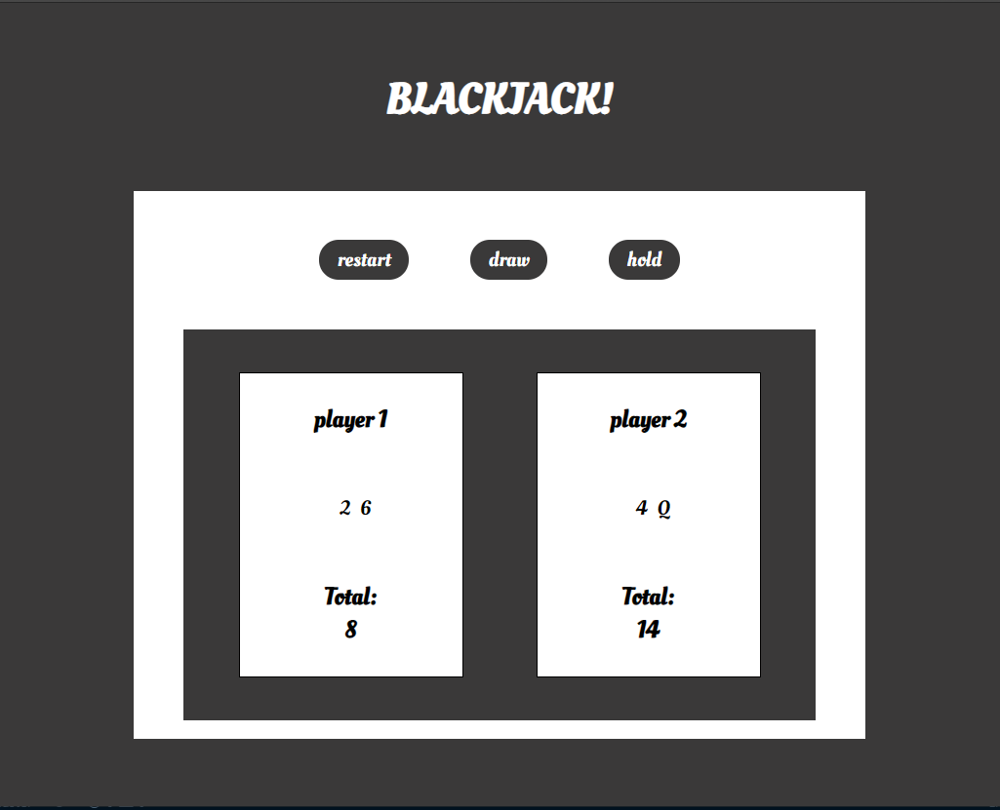
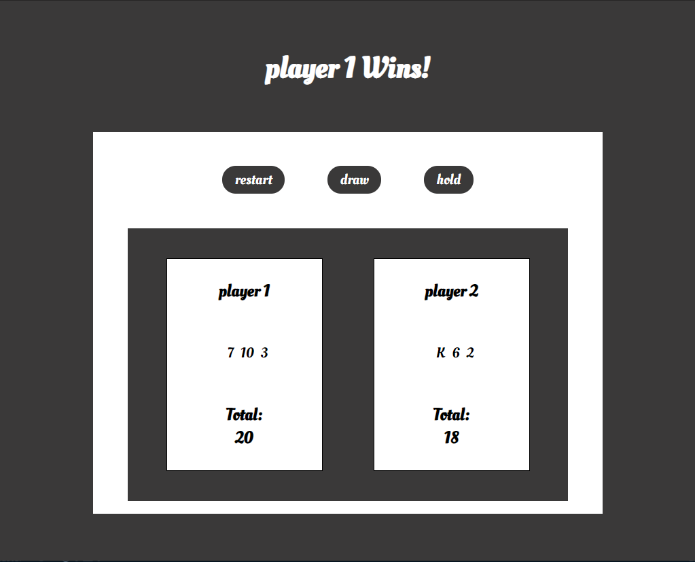

## BlackJackV1
A simple javaScript based Blackjack game. 

## How to play
1. The user can choose to draw a card, or hold
2. Depending on the user's score, the user can draw again or hold
3. If the user goes over 21, the game is over & if he holds the computer draws until their total score is above 17.
4. Once the game is over, you can click restart and try again

## Future Features
1. Hide the computers hand from the user until the users turn is over
2. Host the project

## Project Purpose
This project was created to challenge myself to make my first project completely on my own. It was a fun challenge and I was able to learn a lot.
